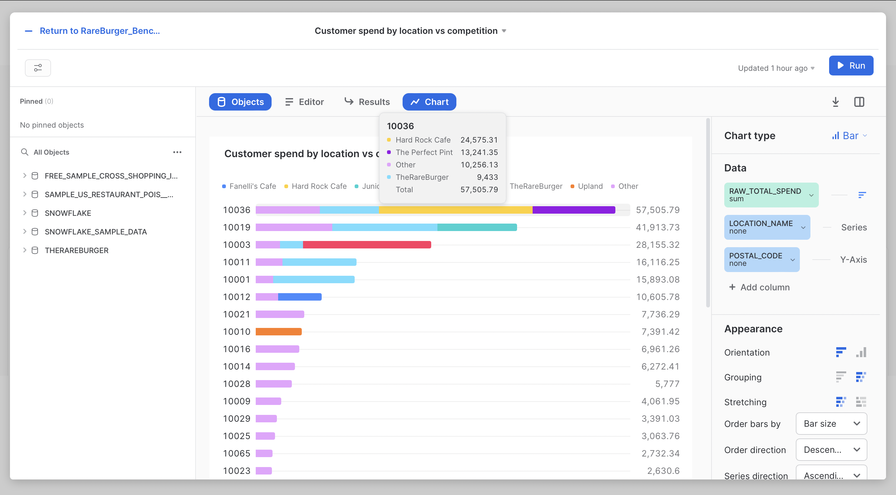

# Snowsight Dashboard 

This goal of this project is analyzing a company's data in Snowflake. Being in the role of Business analyst, this project represents working in the strategy department of a fictional burger chain in NY. The task is to create a dashboard to analyze your company's market share and benchmark it against major competitors. At the end of the project, I was able to:

## Objectives
Use snowflake worksheets to write SQL query and create first Snowsight dashboard.
Navigate the Snowflake UI and source data from Snowflake Data Marketplace.
Create virtual warehouses, database and table to load data into Snowflake.

